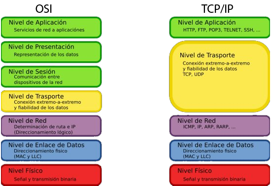
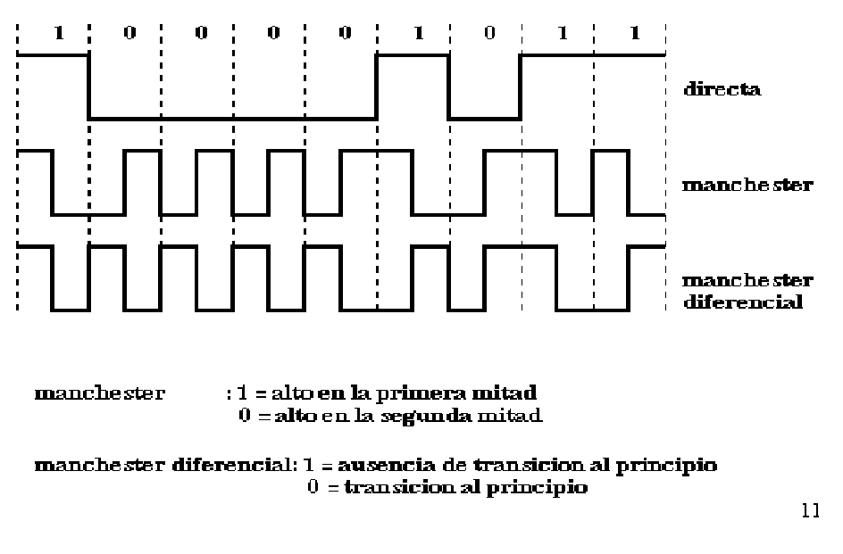
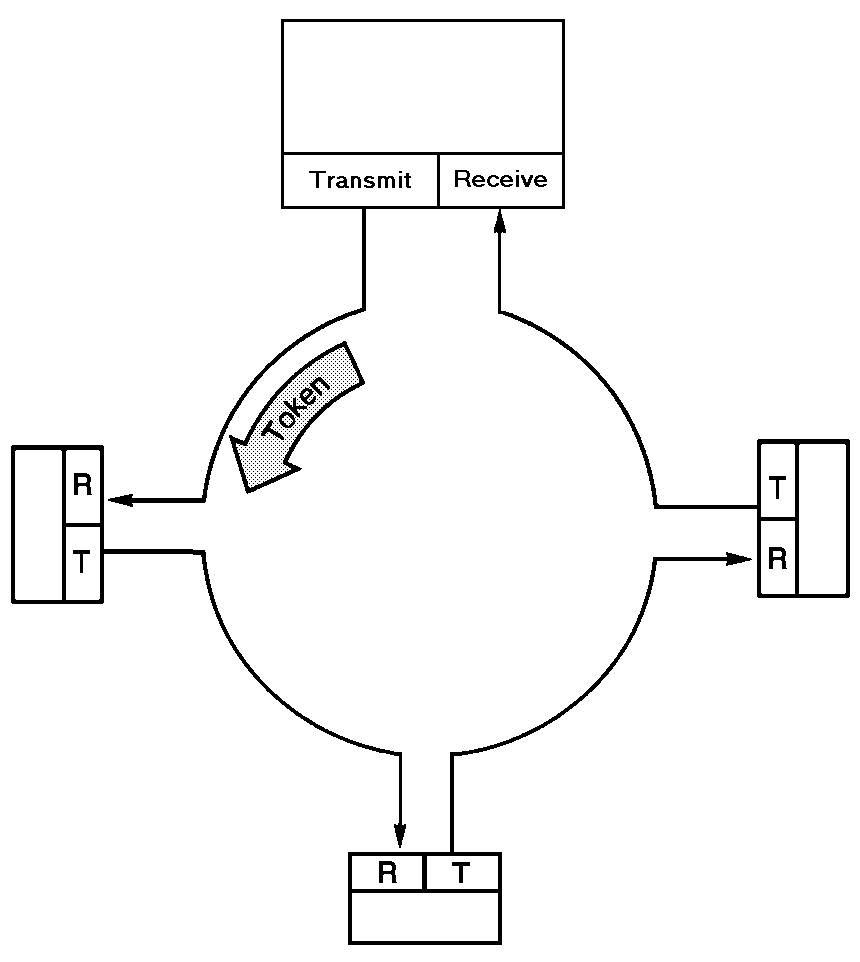
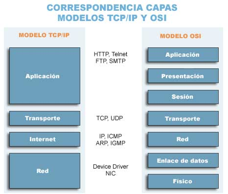
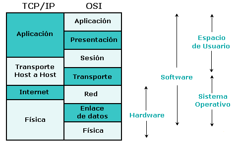
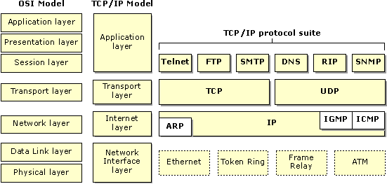

# MiniNET

## Presentación de modelo

"...concepto de “Red galáctica”. [Imaginó un conjunto de ordenadores interconectados globalmente, a través de los que todo el mundo podría acceder rápidamente a datos y programas desde cualquier sitio](https://thingspeak.com/channels/141411)..."

"Leonard Kleinrock, del MIT, publicó el primer documento sobre la teoría de conmutación de paquetes en julio de 1961 y el primer libro sobre el tema en 1964 Kleinrock convenció a Roberts de la factibilidad teorética de *** comunicarse usando paquetes en vez de circuitos *** , lo que fue un gran paso en el viaje hacia las redes informáticas. El otro paso clave fue conseguir que los ordenadores hablasen entre sí."

## Comunicarse usando paquetes en vez de circuitos

### RED CONMUTADA POR CIRCUITOS

Para establecer comunicación se debe efectuar una llamada y cuando se establece la conexión, los usuarios disponen de un enlace directo a través de los distintos segmentos de la red

#### PASOS PARA ESTABLECER LA CONEXION

A) Establecimiento del circuito:

El nodo EMISOR solicita a un cierto nodo CENTRAL el establecimiento de conexión hacia otro nodo RECEPTOR. Otros nodos pueden intervenir en el establecimiento del circuito.

Este circuito se conoce como CANAL DEDICADO.

B) Transferencia de datos:

El nodo EMISOR envia datos al nodo CENTRAL quien los deriva hacia el otro nodo RECEPTOR sin demoras de nodo a nodo.

C) Desconexión del circuito:

El nodo emisor o el receptor indican a su nodo más próximo que ha finalizado la conexión, y este nodo informa al siguiente de este hecho y luego LIBERA EL CANAL DEDICADO.

### RED CONMUTADA POR PAQUETES

Un paquete es un grupo de información que consta de dos partes:

a) Los datos propiamente dichos y

b) la información de control, que especifica la ruta a seguir a lo largo de la red hasta el destino del paquete.

La conmutación de paquetes permite hacer un uso mas eficiente de CANALES DEDICADOS para datos que pueden ser enviados con retardo en la transmisión (no en tiempo real), tales como el correo electrónico, paginas web, archivos, etc.

Estos son factores que ocasionan que los paquetes tomen rutas distintas para llegar a su destino. Por eso se dice que la ruta que toman los paquetes es "probabilística", mientras que en la conmutación de circuitos, esta ruta es "determinística".

DIFERENCIAS

La conmutación de circuitos es un tipo de comunicación que establece o crea un canal dedicado (o circuito) durante la duración de una sesión.

Los sistemas de conmutación de circuitos son ideales para comunicaciones que requieren que los datos/información sean transmitidos en tiempo real(*).

En sistemas basados en conmutación de paquetes la información/datos a ser transmitida previamente es ensamblada en paquetes. Cada paquete es entonces transmitido individualmente y éste puede seguir diferentes rutas hacia su destino. Una vez que los paquetes llegan a su destino, los paquetes son otra vez re-ensamblados. 

## Modelos OSI y TCP-UDP/IP

## Medios compartidos y modulacion

## MANCHESTER

En la codificación Manchester, cada período de un bit se divide en dos intervalos iguales. Un bit binario de valor 1 se transmite con valor de tensión alto en el primer intervalo y un valor bajo en el segundo. Un bit 0 se envía al contrario, es decir, una tensión baja seguida de un nivel de tensión alto.

Este esquema asegura que todos los bits presentan una transición en la parte media, proporcionando así un excelente sincronismo entre el receptor y el transmisor. Una desventaja de este tipo de transmisión es que se necesita el doble del ancho de banda para la misma información que el método convencional.
La codificación diferencial Manchester es una variación puesto que en ella, un bit de valor 1 se indica por la ausencia de transición al inicio del intervalo, mientras que un bit 0 se indica por la presencia de una transición en el inicio, existiendo siempre una transición en el centro del intervalo. El esquema diferencial requiere un equipo más sofisticado, pero ofrece una mayor inmunidad al ruido. El Manchester Diferencial tiene como ventajas adicionales las derivadas de la utilización de una aproximación diferencial.

Todas las técnicas bifase fuerzan al menos una transición por cada bit pudiendo tener hasta dos en ese mismos periodo. Por tanto, la máxima velocidad de modulación es el doble que en los NRZ, esto significa que el ancho de bandoa necesario es mayor. No obstante, los  esquemas bifase tienes varias ventajas:

* Sincronización : debido a la transición que siempre ocurre durante el intervalo de duración correspondiente a un bit, el receptor puede sincronizarse usando dicha transición. Debido a esta característica, los códigos bifase se denominan auto-sincronizados.

* No tienen componente en continua.

* Detección de errores: se pueden detectar errores si se detecta una ausencia de la transición esperada en la mitad del intervalo. Para que el ruido produjera un error no detectado tendría que intervenir la señal antes y después de la transición.

Los códigos bifase se usan con frecuencia en los esquemas de transmisión de datos. Unos de los más conocidos es el código Manchestes que se ha elegido como parte de la especificación de la normalización [IEEE 802.3](http://www.ieee802.org/3/) para la transmisión en redes LAN con un bus CSMA/CD usando cable coaxial en banda base o par trenzado en esquemas del tipo ESTRELLA/MESH. 

El Manchester Diferencial se ha elegido en  la normalización [IEEE 802.5](http://www.ieee802.org/5/www8025org/) para redes LAN en anillo con paso de testigo, en las que se usan pares trenzados apantallados.

### PRACTICA NIVEL FISICO: Transmision y Recepcion de datos en un medio compartido con codificacion MANCHESTER

## Libreria RH

[AIRSPAYCE RadioHead](http://www.airspayce.com/mikem/arduino/RadioHead/)
